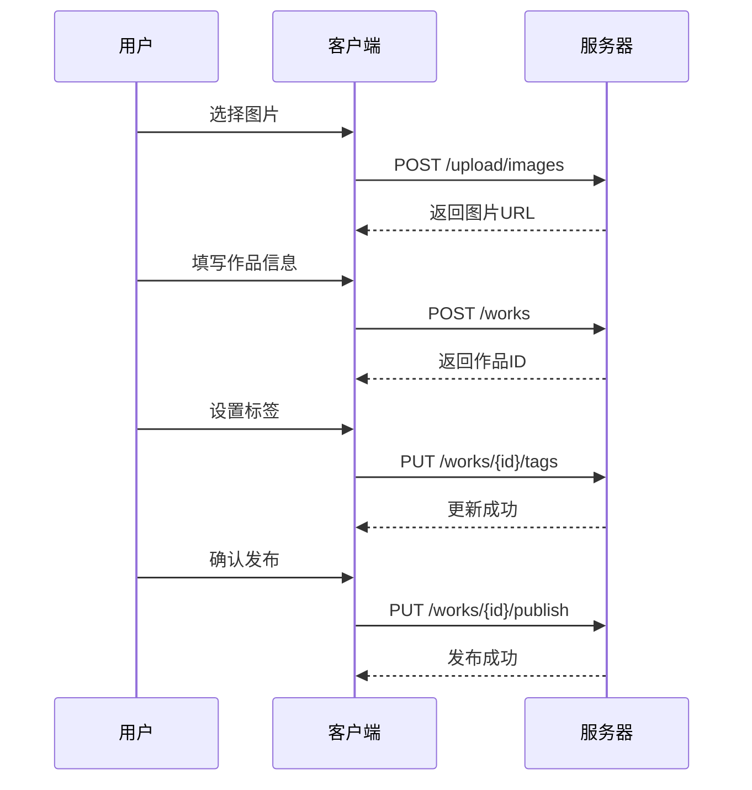

# 📡 API 文档模板

## 文档结构标准

### 1. 接口概览
```markdown
# 作品管理 API

## 基础信息
- **Base URL**: `https://api.dongpaidi.com/v1`
- **认证方式**: Bearer Token
- **数据格式**: JSON
- **字符编码**: UTF-8

## 通用响应格式
```json
{
  "code": 200,
  "message": "success",
  "data": {},
  "timestamp": "2024-01-07T10:30:00Z",
  "requestId": "req_123456789"
}
```

## 错误码说明
| 错误码 | 说明 | 解决方案 |
|--------|------|----------|
| 200 | 成功 | - |
| 400 | 请求参数错误 | 检查请求参数格式 |
| 401 | 未授权 | 检查Token是否有效 |
| 403 | 权限不足 | 联系管理员分配权限 |
| 404 | 资源不存在 | 检查资源ID是否正确 |
| 500 | 服务器内部错误 | 联系技术支持 |
```

### 2. 接口详情模板
```markdown
## 获取作品列表

### 基本信息
- **接口地址**: `/works`
- **请求方法**: `GET`
- **接口描述**: 获取作品列表，支持分页和筛选
- **需要认证**: 否

### 请求参数
| 参数名 | 类型 | 必填 | 默认值 | 说明 | 示例 |
|--------|------|------|--------|------|------|
| page | number | 否 | 1 | 页码，从1开始 | 1 |
| size | number | 否 | 20 | 每页数量，最大100 | 20 |
| category | string | 否 | - | 作品分类 | portrait |
| userId | string | 否 | - | 用户ID | user_123 |
| sortBy | string | 否 | created_at | 排序字段 | likes |
| order | string | 否 | desc | 排序方向 | asc |

### 请求示例
```bash
# 基础请求
GET /works?page=1&size=20

# 筛选特定分类
GET /works?category=portrait&page=1&size=10

# 按点赞数排序
GET /works?sortBy=likes&order=desc
```

### 响应参数
| 参数名 | 类型 | 说明 | 示例 |
|--------|------|------|------|
| list | Work[] | 作品列表 | - |
| pagination | Pagination | 分页信息 | - |

#### Work 对象结构
| 参数名 | 类型 | 说明 | 示例 |
|--------|------|------|------|
| id | string | 作品ID | work_123 |
| title | string | 作品标题 | 城市夜景 |
| description | string | 作品描述 | 美丽的城市夜景 |
| coverImage | string | 封面图片URL | https://... |
| images | string[] | 图片URL数组 | ["https://..."] |
| user | User | 作者信息 | - |
| stats | WorkStats | 统计信息 | - |
| tags | string[] | 标签数组 | ["夜景", "城市"] |
| category | string | 作品分类 | landscape |
| createdAt | string | 创建时间 | 2024-01-07T10:30:00Z |

### 响应示例
```json
{
  "code": 200,
  "message": "success",
  "data": {
    "list": [
      {
        "id": "work_123",
        "title": "城市夜景",
        "description": "美丽的城市夜景摄影作品",
        "coverImage": "https://cdn.example.com/image1.jpg",
        "images": [
          "https://cdn.example.com/image1.jpg",
          "https://cdn.example.com/image2.jpg"
        ],
        "user": {
          "id": "user_123",
          "nickname": "摄影师小王",
          "avatar": "https://cdn.example.com/avatar1.jpg",
          "isPhotographer": true
        },
        "stats": {
          "likes": 156,
          "comments": 23,
          "views": 1200,
          "shares": 45
        },
        "tags": ["夜景", "城市", "建筑"],
        "category": "landscape",
        "createdAt": "2024-01-07T10:30:00Z"
      }
    ],
    "pagination": {
      "page": 1,
      "size": 20,
      "total": 100,
      "totalPages": 5,
      "hasNext": true,
      "hasPrev": false
    }
  }
}
```

### 错误响应示例
```json
{
  "code": 400,
  "message": "Invalid page parameter",
  "data": null,
  "errors": [
    {
      "field": "page",
      "message": "Page must be greater than 0"
    }
  ]
}
```
```

### 3. 业务场景文档
```markdown
## 业务场景：作品发布流程

### 场景描述
用户发布一个新的摄影作品，包括图片上传、信息填写、标签设置等步骤。

### 接口调用流程
1. **上传图片** → `POST /upload/images`
2. **创建作品** → `POST /works`
3. **设置标签** → `PUT /works/{id}/tags`
4. **发布作品** → `PUT /works/{id}/publish`

### 时序图


### 异常处理
- 图片上传失败：重试机制，最多3次
- 网络超时：显示友好提示，支持重新发布
- 内容审核失败：显示具体原因，支持修改后重新提交
```

### 4. SDK 使用文档
```markdown
## JavaScript SDK 使用指南

### 安装
```bash
npm install dongpaidi-sdk
```

### 初始化
```javascript
import { DongPaiDiSDK } from 'dongpaidi-sdk'

const sdk = new DongPaiDiSDK({
  baseURL: 'https://api.dongpaidi.com/v1',
  apiKey: 'your-api-key',
  timeout: 10000
})
```

### 使用示例
```javascript
// 获取作品列表
const works = await sdk.works.getList({
  page: 1,
  size: 20,
  category: 'portrait'
})

// 发布作品
const newWork = await sdk.works.create({
  title: '美丽的日落',
  description: '在海边拍摄的日落景色',
  images: ['https://...'],
  tags: ['日落', '海边', '风景']
})

// 点赞作品
await sdk.works.like('work_123')
```
```
